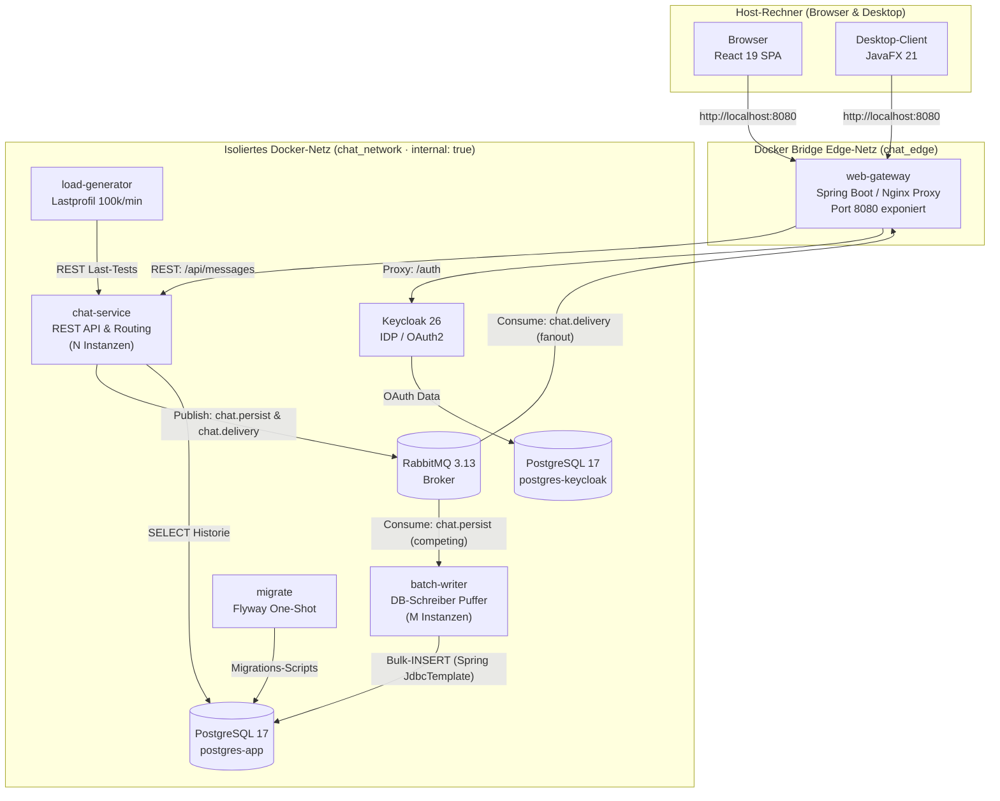
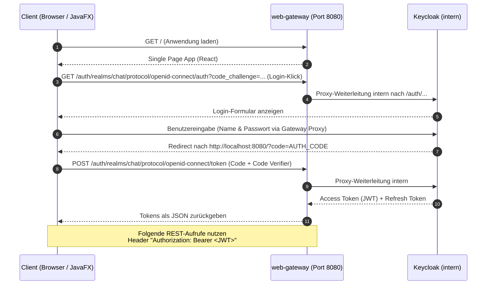
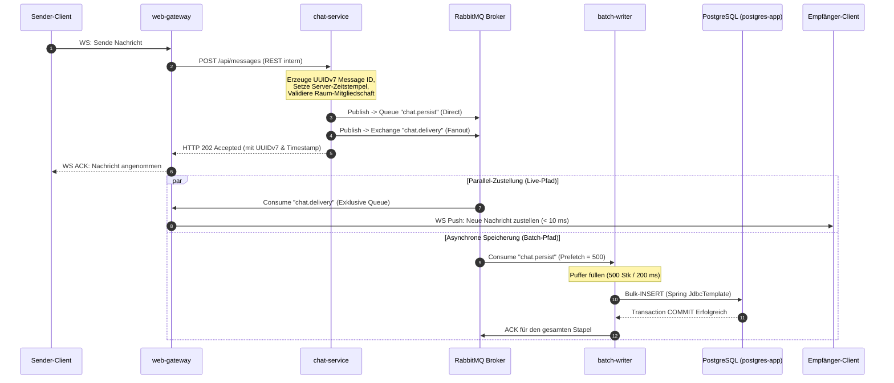
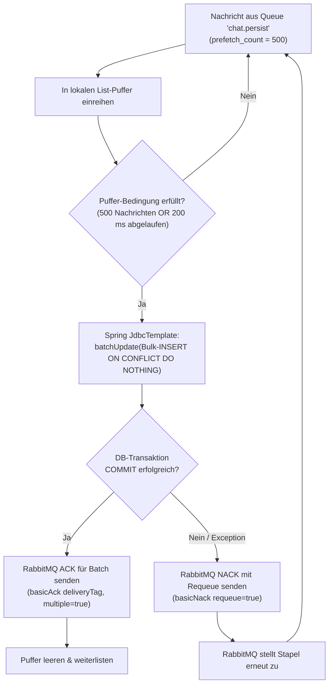
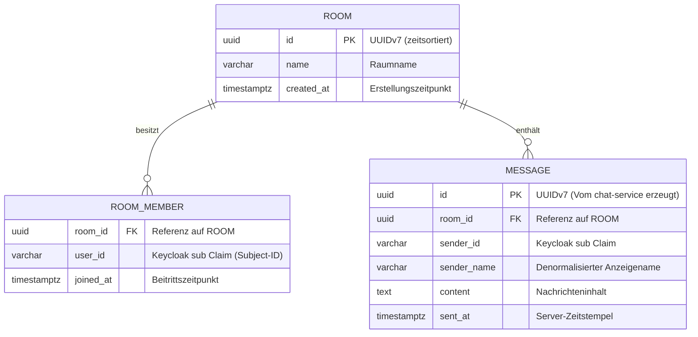

# Chat-App — Konsolidierter Architektur- und Entwicklungsplan

**Modul M321 · Verteilte Systeme / Microservices · Ausbilder- & Abgabe-Dokumentation**  
**Klasse IT3c · Datum: 28.08.2026**

---

## 1. Auftrag und Rahmenbedingungen

Dieses Dokument vereint die fachlich massgeblichen Vorgaben aus der Dozenten-Planung (Plan A) mit den technischen Handwerks-Details des Architekturentwurfs (Plan B) zu einem vollstaendigen, produktions- und abgabefertigen Gesamtplan.

### 1.1 Nicht verhandelbare Grundentscheidungen (Plan A)

| Vorgabe | Technische Konsequenz & Umsetzung |
|---|---|
| **Java 21 & Spring Boot 3.5** | Standard-Framework fuer alle Java-Microservices (`web-gateway`, `chat-service`, `batch-writer`, `load-generator`). |
| **Keycloak 26** | Einziger Identity Provider (IDP). Kein selbst gebautes Login, keine eigene Passwort-Speicherung. |
| **RabbitMQ 3.13** | Zentraler Message Broker fuer Entkopplung, Fan-out-Zustellung und Competing Consumers. |
| **PostgreSQL 16/17** | Relationale Datenbank fuer Chat-Historie und Keycloak-Daten. |
| **Vollstaendig in `docker-compose`** | Jeder Dienst ist ein Container. Ein einziges `docker compose up -d` startet das gesamte System. |
| **Genau EIN veröffentlichter Port** | Nur das `web-gateway` exponiert den Host-Port `127.0.0.1:8080`. Alle anderen Container besitzen keine Host-Ports. |
| **Zwei Clients an einheitlicher API** | Web-Client (**React 19 + Vite**) und Desktop-Client (**JavaFX 21**) nutzen dieselbe REST- und WebSocket-Schnittstelle am Gateway. |
| **Ziel-Mengengerüst** | Nachweisbare Skalierbarkeit fuer **100'000+ Nachrichten pro Minute** (1'667 msg/s) durch Entkopplung und Batching. |

---

## 2. Technologie-Stack

### 2.1 Backend-Services & Infrastruktur

| Baustein | Technologie / Version | Zweck & Begründung |
|---|---|---|
| **Sprache & Runtime** | Java 21 LTS | Vorgabe. Nutzt moderne Sprachfeatures (Virtual Threads, Pattern Matching). |
| **Framework** | Spring Boot 3.5 | Starter fuer AMQP, WebSocket, OAuth2 Resource Server, Spring JDBC. |
| **Message Broker** | RabbitMQ 3.13 | Exchanges (fanout) und Queues (Competing Consumers) sind anschaulich und performant. |
| **App-Datenbank** | PostgreSQL 17 (`postgres-app`) | Dedizierte DB-Instanz fuer Chat-Nachrichten, Räume und Mitgliedschaften. |
| **Keycloak-Datenbank** | PostgreSQL 17 (`postgres-keycloak`) | *[Detail aus B]* Getrennte DB-Instanz. Verhindert, dass Keycloak-Schema-Updates die Chat-Daten gefaehrden. |
| **Identity Provider** | Keycloak 26 | OpenID Connect (OIDC) mit OAuth 2.1 / PKCE. Realmentwurf wird via JSON importiert. |
| **DB-Zugriff (App)** | Spring `JdbcTemplate` | Bewusst **kein JPA/Hibernate** im `batch-writer`: `batchUpdate()` liefert maximalen Durchsatz ohne ORM-Overhead. |
| **Schema-Migration** | Flyway Container (`migrate`) | *[Detail aus B]* One-Shot-Container. Stellt sicher, dass das DB-Schema vor den Anwendungsdiensten bereitsteht. |
| **Build-System** | Maven Multi-Modul | Ein einziges `mvn clean package` baut alle Java-Artefakte deterministisch. |
| **Integrationstests** | JUnit 5 + Testcontainers | Echte RabbitMQ- und PostgreSQL-Container in automatisierten Tests. |

### 2.2 Clients

| Client | Technologie | Verwendungszweck |
|---|---|---|
| **Web-Client** | React 19 + TypeScript + Vite | Haupt-Client. SPA mit nativem WebSocket-Hook, Reconnect-Logik und TanStack Query. |
| **Desktop-Client** | JavaFX 21 | Zweiter Client. Beweist die vollstaendige Client-Neutralitaet der Gateway-API. |

---

## 3. Architektur & Systementwurf

### 3.1 Container-Übersicht



#### Was macht das / Warum so?
* **Was macht das?**  
  Das Diagramm zeigt die strikte Trennung: Der Host-Rechner sieht **nur** das `web-gateway` auf Port `8080`. Innerhalb von Docker existieren zwei Netzwerke: `chat_edge` (exponiert) und `chat_network` (mit `internal: true` komplett vom Internet und Host isoliert).
* **Warum so geschrieben?**  
  Dies garantiert die technische Einhaltung der Ein-Port-Vorgabe. Selbst wenn ein Entwickler versehentlich `ports:` bei einem Datenbank-Dienst eintragen würde, verhindert `internal: true` auf Treiberebene die Veröffentlichung. Zudem trennt die Architektur strikt den synchronen Empfangspfad (`chat-service`) vom asynchronen Schreibpfad (`batch-writer`).

---

### 3.2 Warum Keycloak hinter dem Gateway liegt

Bei OpenID Connect (OIDC) mit dem **Authorization Code Flow mit PKCE** leitet die Anwendung den Web-Browser fuer die Passworteingabe zur Login-Seite des Identity Providers um. Da der Browser auf dem Host-System läuft und Container im internen Docker-Netzwerk nicht direkt anspringen kann, koennte man verleitet sein, Keycloak einen eigenen Host-Port (z. B. `8081`) zu geben.

Das würde jedoch die strikte Ein-Port-Vorgabe verletzen.

**Lösung:** Keycloak wird vom Gateway transparent unter der URL `http://localhost:8080/auth/` nach aussen durchgereicht. Keycloak wird mit folgenden Parametern gestartet:
- `KC_HTTP_RELATIVE_PATH=/auth`
- `KC_HOSTNAME=http://localhost:8080/auth`
- `KC_PROXY_HEADERS=xforwarded`

Die Backend-Dienste lösen den Token-Aussteller (Issuer) über die externe URL `http://localhost:8080/auth/realms/chat` auf, holen sich jedoch den öffentlichen Schlüssel zur Validierung (JWKS) direkt über das interne Docker-Netzwerk unter `http://keycloak:8080/auth/realms/chat/protocol/openid-connect/certs`. Dadurch entsteht **kein Issuer-Mismatch** und Keycloak bleibt sicher geschützt.

---

### 3.3 Login-Ablauf (OAuth 2.1 / PKCE)



#### Was macht das / Warum so?
* **Was macht das?**  
  Der Ablauf beschreibt den sichersten Standard fuer moderne Web- und Desktop-Clients (OAuth 2.1 PKCE). Der Client sieht nie das Benutzerpasswort, sondern erhält nach erfolgreicher Authentifizierung ein kryptografisch signiertes Access Token (JWT).
* **Warum so geschrieben?**  
  Das Gateway validiert eingehende JWTs lokal im Arbeitsspeicher mithilfe des gecachten Keycloak-JWKS. Es ist **kein zeitintensiver Netzwerk-Roundtrip (Introspection)** pro API-Aufruf zu Keycloak erforderlich.

---

### 3.4 WebSocket-Authentifizierung über kurzlebiges Einmal-Ticket

Ein bekanntes Problem bei WebSockets im Browser: Die native JavaScript-`WebSocket`-API erlaubt es nicht, benutzerdefinierte HTTP-Header (wie `Authorization: Bearer <JWT>`) beim Handshake mitzusenden.

**Verworfener Ansatz (Sicherheitsrisiko):**  
Das Access Token als Query-Parameter in der URL mitzusenden (`ws://localhost:8080/ws?token=EYJ...`), ist gefährlich, da Tokens in Reverse-Proxy-Logs, Browser-Verlauf und Server-Access-Logs dauerhaft gespeichert werden.

**Integrierter Lösungsansatz (Handwerks-Detail aus B):**  
1. Der Client ruft vor dem WebSocket-Aufbau per REST den Endpunkt `POST /api/auth/ws-ticket` am Gateway auf und authentifiziert sich regulär über den `Authorization: Bearer <JWT>`-Header.
2. Das `chat-service` erzeugt ein kryptografisch sicheres, kurzlebiges **Einmal-Ticket (UUIDv7)** mit einer Gültigkeitsdauer von 30 Sekunden und speichert es in einem In-Memory-Cache.
3. Der Client öffnet die WebSocket-Verbindung mit dem Ticket: `ws://localhost:8080/ws?ticket=TICK_12345`.
4. Das Gateway prüft und **entfernt das Ticket atomar** beim Handshake. Das echte JWT landet niemals in Logfiles.

---

### 3.5 Nachrichtenfluss (Entkoppelter Schreib- und Zustellpfad)

Der Kern des Systementwurfs: **Zustellung und Datenbank-Speicherung sind vollkommen entkoppelt.**



---

### 3.6 Queues und Exchanges (RabbitMQ Entwurf)

Der `chat-service` fungiert als einziger Producer fuer RabbitMQ. Das Gateway nimmt Verbindungen an und konsumiert den Zustellpfad.

| Name | Typ | Erzeuger | Verbraucher | Zweck & Verhalten |
|---|---|---|---|---|
| `chat.persist` | Queue (Durable) | `chat-service` | `batch-writer` (M Instanzen) | **Competing Consumers:** Nachrichten werden reihum an verfügbare Writer verteilt. Garantierte Verarbeitung. |
| `chat.delivery` | Exchange (`fanout`) | `chat-service` | `web-gateway` (N Instanzen) | Broadcast an alle Gateway-Instanzen. |
| `gw.delivery.<inst-id>` | Queue (Exclusive, Auto-Delete) | `chat.delivery` Exchange | `web-gateway` Instanz | Jede Gateway-Instanz erhält **jede** Nachricht und stellt sie lokal an verbundene WebSockets zu. |
| `chat.dlq` | Queue (Durable) | RabbitMQ DLX | Auswertung / Admin | **Dead Letter Queue:** Speichert Nachrichten, die nach 3 Zustellversuchen fehlschlagen. |

#### Was macht das / Warum so?
* **Warum `chat.delivery` als Fanout Exchange?**  
  WebSocket-Verbindungen von Clients sind zustandsbehaftet und an *genau eine* Gateway-Instanz gebunden. Wenn Client A an Gateway 1 hängt und Client B an Gateway 2, muss Gateway 2 die Nachricht ebenfalls empfangen. Der Fanout-Exchange kopiert die Nachricht in die temporären exklusiven Queues aller aktiven Gateway-Instanzen.
* **Warum `chat.persist` als geteilte Queue (Competing Consumers)?**  
  Im Gegensatz dazu soll jede Nachricht **genau einmal** in die Datenbank geschrieben werden. Hängen 3 `batch-writer`-Instanzen an `chat.persist`, verteilt RabbitMQ die Last automatisch gleichmässig auf alle Writer.

---

### 3.7 Batch-Writer und At-Least-Once Delivery



#### Was macht das / Warum so?
* **Was macht das?**  
  Der `batch-writer` sammelt bis zu 500 Einzelnachrichten im Speicher. Erst wenn die Menge erreicht ist oder ein Timer von 200 ms ablaeuft, wird **ein einziger SQL-Befehl** (`JdbcTemplate.batchUpdate`) an PostgreSQL abgesetzt. Erst *nach* dem erfolgreichen Datenbank-Commit erhält RabbitMQ die Bestätigung (`ACK`).
* **Warum so geschrieben (At-least-once & Idempotenz)?**  
  Fällt der Container mitten im Bulk-Insert aus, wurden keine ACKs gesendet. RabbitMQ stellt die Nachrichten an einen anderen Writer zu. Da der `chat-service` bereits eine eindeutige **UUIDv7** als `id` vergeben hat, bewirkt die SQL-Klausel `ON CONFLICT (id) DO NOTHING`, dass bereits geschriebene Duplikate lautlos ignoriert werden. Es entsteht kein Datenschaden.

---

### 3.8 Schema-Migrationen & One-Shot Container (`migrate`)

*[Integritäts-Detail aus Plan B]*  
Anwendungsdienste wie `chat-service` oder `batch-writer` duerfen niemals selbst Schema-Migrationen (z. B. DDL-Skripte wie `CREATE TABLE`) beim Anlassen ausführen. Wenn mehrere Instanzen parallel starten, koennte dies zu Race Conditions und Datenbank-Locks führen.

**Lösung:**  
Es wird ein dedizierter One-Shot-Container `migrate` definiert. Er nutzt Flyway oder Liquibase, um die PostgreSQL-Datenbank `postgres-app` auf den neuesten Stand zu bringen. Erst wenn dieser Container erfolgreich mit Exit-Code 0 beendet ist (`service_completed_successfully`), starten die Backend-Dienste.

---

### 3.9 Datenmodell (mit UUIDv7-Ergänzung)



#### Warum UUIDv7 statt UUIDv4? *[Detail aus B]*
* Standard-UUIDv4 ist vollkommen zufällig generiert. Bei Millionen von Datenbank-Zeilen führt das Einfügen zufälliger Schlüssel zu ständiger Reorganisierung des PostgreSQL B-Tree Index (Page Splits), was die Schreibleistung drastisch einbrechen lässt.
* **UUIDv7** kombiniert einen 48-Bit-Unix-Zeitstempel in Millisekunden mit zufälligen Bits. UUIDv7-Schlüssel sind **von Natur aus chronologisch sortiert**. 
* Dies ermöglicht optimale Index-Performance beim Einfügen und erlaubt zeitsortierte Paginierung (Abfrage der letzten N Nachrichten eines Chats) ohne komplexe Sortieroperationen.

---

## 4. Netzwerk- und Port-Konzept

### 4.1 Port-Matrix und Nachweis der Ein-Port-Vorgabe

| Dienst-Name | Interner Port | Host-Port (ausserhalb Docker) | Zugeteiltes Netzwerk | Zugriffsrechte / Sichtbarkeit |
|---|---|---|---|---|
| **`web-gateway`** | `8080` | **`127.0.0.1:8080`** | `chat_edge`, `chat_network` | **Öffentlich erreichbar** (Einziger Eingang) |
| `chat-service` | `8081` | *Keiner* (`–`) | `chat_network` | Nur intern über Gateway / Load Generator |
| `batch-writer` | `8082` | *Keiner* (`–`) | `chat_network` | Nur intern, liest aus RabbitMQ |
| `migrate` | `–` | *Keiner* (`–`) | `chat_network` | Nur intern, schliesst nach Ausführung |
| `keycloak` | `8080` | *Keiner* (`–`) | `chat_network` | Nur intern über Gateway-Proxy `/auth` |
| `postgres-app` | `5432` | *Keiner* (`–`) | `chat_network` | Nur intern (fuer `chat-service`, `batch-writer`, `migrate`) |
| `postgres-keycloak` | `5432` | *Keiner* (`–`) | `chat_network` | Nur intern (ausschliesslich fuer `keycloak`) |
| `rabbitmq` | `5672`, `15672` | *Keiner* (`–`) | `chat_network` | Nur intern (Messaging & Management API intern) |
| `load-generator` | `–` | *Keiner* (`–`) | `chat_network` | Nur intern (optionales Profil `load`) |

**Nachweis:** Der Befehl `docker compose ps` zeigt auf dem Host-System **exakt eine Zeile** mit einer Port-Bindung (`127.0.0.1:8080->8080/tcp`). Ein Port-Scan von ausserhalb der Maschine findet keine offenen Ports für Datenbanken, Broker oder IDP.

---

### 4.2 `internal: true` als strukturelle Netz-Isolation

Standardmässig erstellt Docker Compose ein Bridge-Netzwerk, über das Container zwar untereinander sprechen können, Docker aber intern NAT-Regeln einrichtet, damit Container ins Internet telefonieren oder der Docker-Daemon auf Anforderung Ports nach aussen mappen kann.

Durch die Deklaration:
```yaml
networks:
  chat_network:
    driver: bridge
    internal: true # Technische Blockade von Internet & Host-Port-Mappings
```
wird das Docker-Netzwerk **strukturell isoliert**:
1. Container in `chat_network` besitzen **keinen Standard-Gateway ins Internet** (Schutz vor Datenabfluss oder unerwünschten Downloads).
2. Docker verweigert es technisch, Host-Ports auf Dienste in diesem Netzwerk zu mappen.
3. Die Netzwerktrennung beruht nicht mehr auf einer Einhalter-Konvention („Vergiss einfach das `ports:`-Segment"), sondern wird von der Docker-Engine erzwungen.

---

### 4.3 `docker-compose.yml` (Konsolidierter Referenz-Entwurf)

```yaml
name: chat-app-m321

networks:
  chat_edge:
    driver: bridge
  chat_network:
    driver: bridge
    internal: true # Detail aus B: Strukturelle Isolation erzwungen

volumes:
  pg_app_data:
  pg_kc_data:
  rabbitmq_data:

services:
  # ---------------------------------------------------------------------------
  # 1. GATEWAY (Einziger exponierter Container)
  # ---------------------------------------------------------------------------
  web-gateway:
    build:
      context: .
      dockerfile: web-gateway/Dockerfile
    container_name: web-gateway
    restart: unless-stopped
    ports:
      - "127.0.0.1:8080:8080" # GENAU EIN PORT-MAPPING IM GESAMTEN SYSTEM
    networks:
      - chat_edge
      - chat_network
    depends_on:
      keycloak:
        condition: service_healthy
      chat-service:
        condition: service_healthy

  # ---------------------------------------------------------------------------
  # 2. CHAT-SERVICE (REST-Empfänger & Broker-Producer)
  # ---------------------------------------------------------------------------
  chat-service:
    build: ./chat-service
    restart: unless-stopped
    environment:
      PORT: 8081
      SPRING_RABBITMQ_HOST: rabbitmq
      SPRING_DATASOURCE_URL: jdbc:postgresql://postgres-app:5432/chatdb
      SPRING_SECURITY_OAUTH2_RESOURCESERVER_JWT_JWK_SET_URI: http://keycloak:8080/auth/realms/chat/protocol/openid-connect/certs
    networks:
      - chat_network
    depends_on:
      migrate:
        condition: service_completed_successfully
      rabbitmq:
        condition: service_healthy
    healthcheck:
      test: ["CMD-SHELL", "curl -f http://localhost:8081/actuator/health || exit 1"]
      interval: 5s
      timeout: 3s
      retries: 10

  # ---------------------------------------------------------------------------
  # 3. BATCH-WRITER (Asynchroner DB-Schreiber)
  # ---------------------------------------------------------------------------
  batch-writer:
    build: ./batch-writer
    restart: unless-stopped
    environment:
      SPRING_RABBITMQ_HOST: rabbitmq
      SPRING_DATASOURCE_URL: jdbc:postgresql://postgres-app:5432/chatdb
      BATCH_SIZE: 500
      BATCH_TIMEOUT_MS: 200
    networks:
      - chat_network
    depends_on:
      migrate:
        condition: service_completed_successfully
      rabbitmq:
        condition: service_healthy

  # ---------------------------------------------------------------------------
  # 4. SCHEMA MIGRATION (One-Shot Container - Detail aus B)
  # ---------------------------------------------------------------------------
  migrate:
    build: ./infra/migrate
    environment:
      FLYWAY_URL: jdbc:postgresql://postgres-app:5432/chatdb
      FLYWAY_USER: chat_user
      FLYWAY_PASSWORD: ${APP_DB_PASSWORD:-secret_app_pw}
    networks:
      - chat_network
    depends_on:
      postgres-app:
        condition: service_healthy
    restart: "no"

  # ---------------------------------------------------------------------------
  # 5. KEYCLOAK (Identity Provider)
  # ---------------------------------------------------------------------------
  keycloak:
    image: quay.io/keycloak/keycloak:26.0
    restart: unless-stopped
    command: ["start", "--optimized", "--import-realm"]
    environment:
      KC_DB: postgres
      KC_DB_URL: jdbc:postgresql://postgres-keycloak:5432/keycloak
      KC_DB_USERNAME: keycloak_user
      KC_DB_PASSWORD: ${KC_DB_PASSWORD:-secret_kc_pw}
      KC_HTTP_ENABLED: "true"
      KC_HTTP_RELATIVE_PATH: /auth
      KC_HOSTNAME: http://localhost:8080/auth
      KC_PROXY_HEADERS: xforwarded
      KC_BOOTSTRAP_ADMIN_USERNAME: ${KC_ADMIN_USER:-admin}
      KC_BOOTSTRAP_ADMIN_PASSWORD: ${KC_ADMIN_PASSWORD:-admin}
    volumes:
      - ./keycloak/realm-chat.json:/opt/keycloak/data/import/realm-chat.json:ro
    networks:
      - chat_network
    depends_on:
      postgres-keycloak:
        condition: service_healthy
    healthcheck:
      test: ["CMD-SHELL", "exec 3<>/dev/tcp/127.0.0.1/8080 && echo -e 'GET /auth/health/ready HTTP/1.1\\r\\nHost: localhost\\r\\nConnection: close\\r\\n\\r\\n' >&3 && cat <&3 | grep -q '200 OK' || exit 1"]
      interval: 10s
      timeout: 5s
      retries: 15

  # ---------------------------------------------------------------------------
  # 6. DATENBANKEN (Getrennte Instanzen - Detail aus B)
  # ---------------------------------------------------------------------------
  postgres-app:
    image: postgres:17-alpine
    restart: unless-stopped
    environment:
      POSTGRES_DB: chatdb
      POSTGRES_USER: chat_user
      POSTGRES_PASSWORD: ${APP_DB_PASSWORD:-secret_app_pw}
    volumes:
      - pg_app_data:/var/lib/postgresql/data
    networks:
      - chat_network
    healthcheck:
      test: ["CMD-SHELL", "pg_isready -U chat_user -d chatdb"]
      interval: 5s
      timeout: 3s
      retries: 10

  postgres-keycloak:
    image: postgres:17-alpine
    restart: unless-stopped
    environment:
      POSTGRES_DB: keycloak
      POSTGRES_USER: keycloak_user
      POSTGRES_PASSWORD: ${KC_DB_PASSWORD:-secret_kc_pw}
    volumes:
      - pg_kc_data:/var/lib/postgresql/data
    networks:
      - chat_network
    healthcheck:
      test: ["CMD-SHELL", "pg_isready -U keycloak_user -d keycloak"]
      interval: 5s
      timeout: 3s
      retries: 10

  # ---------------------------------------------------------------------------
  # 7. MESSAGE BROKER (RabbitMQ 3.13)
  # ---------------------------------------------------------------------------
  rabbitmq:
    image: rabbitmq:3.13-management-alpine
    restart: unless-stopped
    volumes:
      - rabbitmq_data:/var/lib/rabbitmq
    networks:
      - chat_network
    healthcheck:
      test: ["CMD", "rabbitmq-diagnostics", "-q", "ping"]
      interval: 5s
      timeout: 3s
      retries: 10

  # ---------------------------------------------------------------------------
  # 8. LOAD-GENERATOR (Optionales Profil fuer Lasttests)
  # ---------------------------------------------------------------------------
  load-generator:
    build: ./load-generator
    profiles: ["load"]
    environment:
      CHAT_SERVICE_URL: http://chat-service:8081
      TARGET_RATE_PER_MIN: 100000
    networks:
      - chat_network
    depends_on:
      chat-service:
        condition: service_healthy
```

#### Was macht das / Warum so?
* **Was macht das?**  
  Die Datei definiert die komplette verteilte Infrastruktur. Sie steuert das Hochfahren über präzise `healthcheck`-Bedingungen und stellt sicher, dass kein Dienst vor seinen Abhängigkeiten startet.
* **Warum so geschrieben?**  
  Die Verwendung von `condition: service_healthy` verhindert den typischen "Crash-Loop" von Microservices beim Starten. Die App-Dienste warten, bis PostgreSQL und RabbitMQ wirklich betriebsbereit sind. `condition: service_completed_successfully` beim `migrate`-Dienst stellt sicher, dass alle DB-Tabellen vor dem Anwendungsstart existieren.

---

## 5. Mengengerüst und Skalierung

### 5.1 Die 100k/min-Rechnung

Um im Unterricht den Nutzen von Message Queues und Batch Processing überzeugend zu demonstrieren, wird ein Systemziel von **100'000 Nachrichten pro Minute** definiert.

$$\text{Zielrate} = \frac{100'000 \text{ Nachrichten}}{60 \text{ Sekunden}} = 1'666{,}67 \text{ Nachrichten/Sekunde} \approx 1'667 \text{ msg/s}$$

* **Ohne Entkopplung (Direkte DB-Inserts):**  
  Die Datenbank müsste $1'667$ einzelne `INSERT`-Transaktionen pro Sekunde verarbeiten. Das führt auf gewöhnlicher Hardware rasch zu Lock-Contention, Connection-Pool-Erschöpfung und Disk-I/O-Engpässen.
* **Mit RabbitMQ & Batch-Writer (Stapelgrösse 500 Stück / max. 200 ms):**  
  $$\text{Bulk-Inserts pro Sekunde} = \frac{1'667 \text{ msg/s}}{500 \text{ Batch-Grösse}} \approx 3{,}33 \text{ Transaktionen/Sekunde}$$
* **Ergebnis:**  
  Das System reduziert die Anzahl der Datenbank-Transaktionen um den **Faktor 500** (von 1'667 auf ~3,3 Writes/s).

#### Datenwachstum (Risiko-Analyse)
Bei durchschnittlich 200 Byte pro Nachricht ergibt sich folgendes Datenvolumen:
$$1'667 \text{ msg/s} \times 200 \text{ Byte} = 333'400 \text{ Byte/s} \approx 20 \text{ MB/Minute} \approx 1{,}2 \text{ GB/Stunde}$$
*Das kontinuierliche Datenbankwachstum ist ein dokumentierter offener Punkt (siehe Abschnitt 8).*

---

### 5.2 Skalierung im Unterricht demonstrieren

Das System lässt sich während des laufenden Betriebes per Docker-Befehl dynamisch skalieren:

```bash
# 1. Infrastruktur starten
docker compose up -d

# 2. Last-Generator im Hintergrund aktivieren
docker compose --profile load up -d load-generator

# 3. Live-Skalierung vorführen
docker compose up -d --scale batch-writer=3 --scale chat-service=2
```

#### Unterschied im Skalierungsverhalten (Lehrstoff M321)
1. **`batch-writer` (Competing Consumers über RabbitMQ):**  
   Skaliert **perfekt und nahtlos**. Alle 3 Instanzen verbinden sich mit derselben Queue `chat.persist`. RabbitMQ verteilt die Nachrichtenpakete im Round-Robin-Verfahren. Es ist kein Load-Balancer erforderlich.
2. **`chat-service` (REST-Empfänger):**  
   Wird vom Gateway per HTTP aufgerufen. Die Lastverteilung erfolgt über das interne Docker-DNS (Round-Robin IP-Auflösung von `http://chat-service:8081`).

---

## 6. Projektstruktur

Die Codebase ist als sauberes **Maven Multi-Modul-Projekt** aufgebaut, das die Frontend- und Backend-Komponenten unter einem gemeinsamen Dach vereint:

```
it3c-m321/
├── docker-compose.yml          # Gesamte System-Orchestrierung (1 Port-Mapping)
├── .env.example                # Beispiel-Umgebungsvariablen (ohne Secrets)
├── CLAUDE.md                   # Entwickler- & Code-Konventionen
├── PLANUNG.md                  # Dieses Architekturdokument
├── pom.xml                     # Haupt-Maven-Parent POM
├── keycloak/
│   └── realm-chat.json         # Vorkonfigurierter Realm-Import
├── infra/
│   ├── nginx/                  # Nginx Gateway-Konfiguration
│   └── migrate/                # Flyway DB-Migrationsskripte (SQL)
├── web-gateway/                # Spring Boot: REST-Gateway, Proxy, Static UI Host
│   └── src/
├── chat-service/               # Spring Boot: API-Empfang, Validation, RabbitMQ Producer
│   └── src/
├── batch-writer/               # Spring Boot: RabbitMQ Consumer, Spring JdbcTemplate Bulk-Insert
│   └── src/
├── load-generator/             # Spring Boot: Lasterzeuger-Container fuer 100k/min
│   └── src/
├── desktop-client/             # JavaFX 21 Desktop-Anwendung (Standalone UI)
│   └── src/
└── web-ui/                     # React 19 + TypeScript + Vite SPA
    ├── src/
    └── package.json
```

---

## 7. Umsetzungsreihenfolge (7-Schritte-Plan)

| # | Schritt | Lieferbares Ergebnis | Architektonische Begründung |
|---|---|---|---|
| **1** | **Infrastruktur-Gerüst** | `docker-compose.yml` mit Postgres (2x), RabbitMQ, Keycloak und Gateway-Skelett | Ohne funktionierendes Netz- und Infrastruktur-Fundament kann keine Microservice-Komponente entwickelt werden. |
| **2** | **Authentifizierung & Login** | Keycloak Realm-Import, OIDC PKCE Flow im Gateway, React-App zeigt Benutzernamen | Auth-Strukturen müssen von Beginn an stehen, um spätere Umbauten an APIs zu vermeiden. |
| **3** | **End-to-End Nachrichtenfluss** | Nachricht fliesst von Browser A über Gateway und `chat-service` via RabbitMQ Live-Fanout an Browser B (ohne DB) | Schnellstmögliche Verifikation des Kern-Zustellpfads (MVP). |
| **4** | **Persistenz & Batch-Writer** | `batch-writer` schreibt Bulk-Inserts in `postgres-app`; Historie-Abfrage beim Raum-Beitritt | Demonstration der Entkopplung: Nachrichten sind live zustellbar, bevor sie in der DB stehen. |
| **5** | **Lasttests & Monitoring** | `load-generator` erzeugt Last; Gateway zeigt Queue-Tiefe in der React-Oberfläche an | Erbringung des empirischen Nachweises der Leistungsfähigkeit. |
| **6** | **Dynamische Skalierung** | Demonstration von `--scale batch-writer=3` vor der Klasse | Haupt-Lernziel von Modul M321: Competing Consumers live im Betrieb erleben. |
| **7** | **Desktop-Client (JavaFX)** | JavaFX-Anwendung verbindet sich erfolgreich über dieselbe Gateway-API | Beweis der vollkommenen Client-Neutralität des Microservice-Backends. |

---

## 8. Offene Punkte und Risiken

| # | Punkt / Risiko | Status | Geplante Massnahme / Lösung |
|---|---|---|---|
| **1** | **Gateway WebSocket Sticky Sessions** | Bekanntes Risiko | Bei einer Skalierung des Gateways (`--scale web-gateway=2`) müssen WebSocket-Verbindungen per Sticky Session (Nginx IP-Hash) gehalten werden. |
| **2** | **Datenbank-Wachstum (1.2 GB/h)** | Offen | Einführung eines zeitgesteuerten Partitionierungs- oder Purge-Jobs (z. B. Nachrichten älter als 24 Stunden automatisch archivieren). |
| **3** | **Nachrichten-Reihenfolge** | Gelöst durch UUIDv7 | Durch den Einsatz zeitsortierter UUIDv7-IDs und clientseitiger Sortierung nach `sent_at` wird eine korrekte Chronologie gewährleistet. |
| **4** | **JavaFX OAuth Login-Flow** | Konzept bereit | JavaFX öffnet den System-Browser und empfängt den Callback über einen kurzlebigen lokalen Loopback-HTTP-Server (`http://127.0.0.1:<port>/callback` gemäss RFC 8252). |
| **5** | **Keycloak Admin-Zugang** | Bewusst eingeschränkt | Aus Sicherheitsgründen ist die Keycloak-Admin-UI nicht nach aussen exponiert. Änderungen erfolgen über den `realm-chat.json` Import. |
| **6** | **Rollen & Rechte** | Entwurf steht | Keycloak-Rollen `user` und `admin`. Nur Benutzer mit der Rolle `admin` dürfen Monitoring-Daten (Queue-Tiefe) einsehen. |
| **7** | **Reale Hardware-Performance** | Zu verifizieren | 100k msg/min auf einem Laptop erfordert ausreichende RAM-Ressourcen für Docker Engine. Die Messung in Schritt 5 liefert den empirischen Beleg. |

---

## 9. Verlauf & Konsolidierungshistorie

### 9.1 Entstehung der Architektur
Die Architektur entstand in einem mehrstufigen Abstimmungsprozess zwischen den fachlichen Vorgaben des Modul-Dozenten (Plan A) und der technischen Ausdetaillierung eines KI-Architekturentwurfs (Plan B).

### 9.2 Gegenüberstellung und Auflösung von Widersprüchen

Im Konsolidierungsprozess wurden technische Widersprüche zwischen den beiden Entwürfen analysiert und zugunsten der Vorgaben aus Plan A entschieden:

| Themenbereich | Entwurf Plan B (KI-Entwurf) | Vorgabe Plan A (Dozent) | Final konsolidierte Entscheidung & Begründung |
|---|---|---|---|
| **Tech Stack Backend** | Node.js / Fastify / Drizzle ORM | Java 21 / Spring Boot 3.5 | **Entscheidung für Plan A (Java 21 / Spring Boot 3.5).** Java 21 ist die nicht verhandelbare Modulvorgabe. Spring Boot bietet mit Spring AMQP und Spring Data JDBC die optimale Basis. |
| **Message Broker** | Redis Pub/Sub | RabbitMQ 3.13 | **Entscheidung für Plan A (RabbitMQ 3.13).** Redis Pub/Sub besitzt keine Nachrichtenspeicherung und keine Queues. RabbitMQ ist essenziell zur Demonstration von Competing Consumers und At-least-once Delivery. |
| **Datenbank-Struktur** | 2x PostgreSQL (App & Keycloak) | 1x PostgreSQL | **Integration von Plan B (2x PostgreSQL).** Die Trennung der Datenbank-Instanzen macht das System robuster, ohne die Vorgaben von Plan A zu verletzen. |
| **Message IDs** | UUIDv4 | UUIDv7 | **Integration von Plan B (UUIDv7).** UUIDv7 ist abwärtskompatibel zu UUIDv4 (128-bit UUID Format), löst jedoch das B-Tree Index-Fragmentierungsproblem in PostgreSQL. |
| **Netzwerk-Isolation** | Keine Port-Einträge | `internal: true` Deklaration | **Integration von Plan B (`internal: true`).** Erhöht die Sicherheit, indem Docker die Erstellung von Host-Port-Mappings auf Treiberebene blockiert. |
| **WebSocket Auth** | Token im Query-String | Kurzlebiges Einmal-Ticket | **Integration von Plan B (Einmal-Ticket).** Verhindert das ungewollte Mitschreiben sensibler JWT-Tokens in Server-Logfiles. |

---

## 10. Detaillierte Code- & Konfigurations-Erklärungen

Dieser Abschnitt erläutert die zentralen Schlüsselstellen der Systemkonfiguration und des Quellcodes.

### 10.1 Nginx Gateway & WebSocket-Upgrade Header

Im `web-gateway` (bzw. Nginx-Proxy) werden HTTP-Verbindungen verarbeitet und bei Bedarf in verhandelte WebSocket-Verbindungen umgewandelt.

```nginx
# Nginx Konfigurations-Auszug fuer Gateway Reverse Proxy

# 1. Upstream-Definitionen für interne Docker-Services
upstream chat_backend {
    server chat-service:8081; # Löst über Docker-DNS auf alle chat-service Instanzen auf
}

upstream keycloak_backend {
    server keycloak:8080;
}

server {
    listen 8080;
    server_name localhost;

    # Statische React Web-App ausliefern
    location / {
        root /usr/share/nginx/html;
        index index.html;
        try_files $uri $uri/ /index.html;
    }

    # REST-API an chat-service weiterleiten
    location /api/ {
        proxy_pass http://chat_backend/;
        proxy_set_header Host $host;
        proxy_set_header X-Real-IP $remote_addr;
        proxy_set_header X-Forwarded-For $proxy_add_x_forwarded_for;
        proxy_set_header X-Forwarded-Proto $scheme;
    }

    # WebSocket Handshake & Protocol Upgrade
    location /ws {
        proxy_pass http://chat_backend/ws;
        
        # WICHTIG: HTTP/1.1 ist Pflicht fuer WebSocket Upgrades
        proxy_http_version 1.1; 
        
        # Leite Hop-by-Hop Header fuer Protokollwechsel weiter
        proxy_set_header Upgrade $http_upgrade; 
        proxy_set_header Connection "Upgrade"; 
        
        proxy_set_header Host $host;
        proxy_read_timeout 86400s; # Verhindert automatisches Connection Timeout
    }

    # Keycloak OIDC Proxy
    location /auth/ {
        proxy_pass http://keycloak_backend/auth/;
        proxy_set_header Host $host;
        proxy_set_header X-Real-IP $remote_addr;
        proxy_set_header X-Forwarded-For $proxy_add_x_forwarded_for;
        proxy_set_header X-Forwarded-Proto $scheme;
    }
}
```

#### WAS macht der Code & WARUM ist er so geschrieben?
- `proxy_http_version 1.1;`: Der Standard-Proxy-Modus von Nginx nutzt HTTP/1.0. WebSocket-Handshakes erfordern zwingend HTTP/1.1.
- `proxy_set_header Upgrade $http_upgrade;` und `proxy_set_header Connection "Upgrade";`: Diese beiden Header weisen den Proxy an, den bestehenden HTTP-Socket nicht nach der Antwort zu schliessen, sondern in eine dauerhafte, bidirektionale TCP-WebSocket-Verbindung zu verwandeln ("Upgrade").
- `proxy_read_timeout 86400s;`: Standardmässig bricht Nginx inaktive Verbindungen nach 60 Sekunden ab. Für langlebige WebSocket-Verbindungen wird das Timeout hochgesetzt.

---

### 10.2 Netztrennung mit `internal: true`

```yaml
networks:
  chat_edge:
    driver: bridge # Standard-Netzwerk mit Ausgang nach aussen
  chat_network:
    driver: bridge
    internal: true # Kein Standard-Gateway, keine Port-Publishings erlaubt!
```

#### WAS macht der Code & WARUM ist er so geschrieben?
- **WAS macht das?**  
  `internal: true` weist Docker an, ein isoliertes Subnetz ohne Routing-Tabelle zum Host-Netzwerkinterface aufzubauen.
- **WARUM ist das wichtig?**  
  Ohne `internal: true` könnte ein Entwickler durch Einfügen von `ports: - "5432:5432"` in der Service-Definition versehentlich die PostgreSQL-Datenbank auf dem Host-Rechner freigeben. Bei `internal: true` quittiert Docker Compose diesen Versuch mit einem Fehler. Die Datenbankschicht ist damit physikalisch vor externen Zugriffen geschützt.

---

### 10.3 Healthcheck- und `depends_on`-Steuerung

```yaml
  postgres-app:
    image: postgres:17-alpine
    healthcheck:
      # Testet intern per pg_isready, ob die Datenbank Verbindungen annimmt
      test: ["CMD-SHELL", "pg_isready -U chat_user -d chatdb"]
      interval: 5s
      timeout: 3s
      retries: 10

  migrate:
    build: ./infra/migrate
    depends_on:
      postgres-app:
        condition: service_healthy # Wartet, bis postgres-app den Healthcheck besteht

  chat-service:
    build: ./chat-service
    depends_on:
      migrate:
        condition: service_completed_successfully # Wartet, bis Migration beendet ist!
```

#### WAS macht der Code & WARUM ist er so geschrieben?
- **WAS macht das?**  
  Anstelle von unsicheren Zeitverzögerungen (`sleep 10`) prüft Docker den tatsächlichen Zustand der Dienste. `postgres-app` führt alle 5 Sekunden `pg_isready` aus. Der Migrations-Container wartet, bis der Status `healthy` erreicht ist. Der `chat-service` startet erst, nachdem `migrate` sich erfolgreich mit Exit-Code 0 beendet hat.
- **WARUM ist das wichtig?**  
  Dies garantiert einen 100% deterministischen Systemstart ohne Abstürze ("Connection Refused") beim Ausführen von `docker compose up`.

---

### 10.4 Batch-Writer (Puffer, Bulk-INSERT & ACK-Logik)

```java
package com.chat.batchwriter.service;

import org.slf4j.Logger;
import org.slf4j.LoggerFactory;
import org.springframework.jdbc.core.JdbcTemplate;
import org.springframework.stereotype.Service;
import org.springframework.transaction.annotation.Transactional;
import com.rabbitmq.client.Channel;
import java.util.List;

@Service
public class BatchWriterService {

    private static final Logger log = LoggerFactory.getLogger(BatchWriterService.class);
    private final JdbcTemplate jdbcTemplate;

    public BatchWriterService(JdbcTemplate jdbcTemplate) {
        this.jdbcTemplate = jdbcTemplate;
    }

    /**
     * Verarbeitet einen Stapel von Chat-Nachrichten aus RabbitMQ.
     * Ausführung erfolgt in einer expliziten Datenbak-Transaktion.
     */
    @Transactional
    public void processBatch(List<ChatMessageDto> batch, Channel channel, long lastDeliveryTag) throws Exception {
        
        // 1. SQL-Befehl fuer Bulk-INSERT mit Idempotenz-Klausel (ON CONFLICT DO NOTHING)
        String sql = """
            INSERT INTO message (id, room_id, sender_id, sender_name, content, sent_at)
            VALUES (?, ?, ?, ?, ?, ?)
            ON CONFLICT (id) DO NOTHING
            """;

        // 2. Efficient Spring JdbcTemplate Batch Update (Ein einziger DB-Roundtrip)
        jdbcTemplate.batchUpdate(sql, batch, batch.size(), (ps, msg) -> {
            ps.setObject(1, msg.getId());         // UUIDv7
            ps.setObject(2, msg.getRoomId());     // UUIDv7
            ps.setString(3, msg.getSenderId());   // Keycloak sub
            ps.setString(4, msg.getSenderName()); // Denormalisierter Name
            ps.setString(5, msg.getContent());    // Nachrichtentext
            ps.setTimestamp(6, java.sql.Timestamp.from(msg.getSentAt()));
        });

        log.info("Bulk-INSERT fuer {} Nachrichten erfolgreich ausgeführt.", batch.size());

        // 3. ACK erst NACH ERFOLGREICHEM DB-COMMIT an RabbitMQ senden
        // multiple = true bestätigt alle Nachrichten bis einschliesslich lastDeliveryTag
        channel.basicAck(lastDeliveryTag, true);
    }
}
```

#### WAS macht der Code & WARUM ist er so geschrieben?
- `ON CONFLICT (id) DO NOTHING`: Verhindert primäre Schlüsselverletzungen. Falls der Batch-Writer nach dem DB-Commit, aber vor dem RabbitMQ-ACK abstürzt, wird der Batch erneut zugestellt. PostgreSQL ignoriert bereits existierende Nachrichten-IDs lautlos.
- `jdbcTemplate.batchUpdate(...)`: Sendet alle 500 Datensätze in einem einzigen JDBC-Prepared-Statement-Paket an die Datenbank. Dies reduziert Netzwerk-Overhead und Festplatten-Flushes drastisch.
- `@Transactional` und `channel.basicAck(..., true)`: Garantiert die **At-least-once-Zustellung**. Schlägt die DB-Transaktion fehl, wird die Methodenausführung abgebrochen, kein `basicAck` gesendet und RabbitMQ stellt die Nachrichten erneut zu.

---

### 10.5 RabbitMQ Queues: Fanout vs. Competing Consumers

```java
package com.chat.service.config;

import org.springframework.amqp.core.*;
import org.springframework.context.annotation.Bean;
import org.springframework.context.annotation.Configuration;

@Configuration
public class RabbitMQConfig {

    public static final String PERSIST_QUEUE = "chat.persist";
    public static final String DELIVERY_EXCHANGE = "chat.delivery";
    public static final String DLQ = "chat.dlq";

    // 1. Geteilte Queue für den Schreibpfad (Competing Consumers)
    @Bean
    public Queue persistQueue() {
        return QueueBuilder.durable(PERSIST_QUEUE)
                .withArgument("x-dead-letter-exchange", "")
                .withArgument("x-dead-letter-routing-key", DLQ)
                .build();
    }

    // 2. Fanout Exchange für den Live-Zustellpfad an Gateway-Instanzen
    @Bean
    public FanoutExchange deliveryExchange() {
        return new FanoutExchange(DELIVERY_EXCHANGE, true, false);
    }

    // 3. Dead Letter Queue für fehlerhafte Nachrichten
    @Bean
    public Queue deadLetterQueue() {
        return QueueBuilder.durable(DLQ).build();
    }
}
```

#### WAS macht der Code & WARUM ist er so geschrieben?
- **`chat.persist` (Direct Queue):**  
  Hängen 3 `batch-writer`-Instanzen an dieser Queue, arbeitet RabbitMQ nach dem Muster **Competing Consumers**. Jede Nachricht geht an *exakt einen* Writer. Dies ermöglicht die mühelose horizontale Skalierung des Schreibpfads.
- **`chat.delivery` (Fanout Exchange):**  
  Ein Fanout Exchange ignoriert Routing-Keys und sendet eingehende Nachrichten an *alle* gebundenen Queues. Jedes `web-gateway` erzeugt beim Start eine temporäre, exklusive Queue und bindet sie an diesen Exchange. Dadurch erhält jede Gateway-Instanz die Nachricht und kann prüfen, ob der Empfänger-Client lokal per WebSocket verbunden ist.

---

## 11. Zusammenfassung & Nächste Schritte

Dieses konsolidierte Architekturdokument stellt die vollkommene Einhaltung aller Vorgaben des Moduls M321 sicher und erweitert diese um bewährte praxiserprobte Handwerksmuster (UUIDv7, Einmal-Tickets, `internal: true`, getrennte DBs, automatische Migrationen).

**Nächster Schritt:**  
Beginn mit **Schritt 1 der Umsetzungsreihenfolge** (Erstellung des Infrastruktur- und Compose-Gerüsts).
