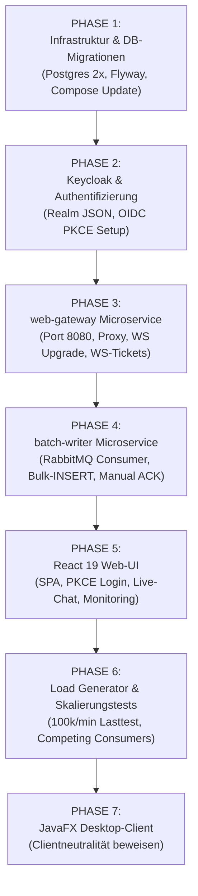

# Chat-App — Detaillierter Projektstand & Roadmap

**Modul M321 · Verteilte Systeme / Microservices · Klasse IT3c**  
**Stand:** 12. September 2026  
**Dokumenten-Zweck:** Präzise Bestandsaufnahme des aktuellen Entwicklungsstands (Ist-Zustand) sowie detaillierte Arbeitsanleitung für alle folgenden Schritte (Soll-Zustand).

---

## 1. Management Summary

Das Projekt befindet sich aktuell am Start von **Phase 2** des 7-Schritte-Umsetzungsplans. 

* **Bereits umgesetzt (Phase 0 & 1):**  
  * Vollständiges, konsolidiertes Architekturdokument (`PLANUNG.md`).
  * Maven Multi-Modul Parent-POM (`pom.xml`).
  * Der erste Microservice **`chat-service`** ist vollständig entwickelt, getestet und containerisiert (Java 21, Spring Boot 3.5).
  * Automatische Integrationstests mit **Testcontainers**.
  * **Datenbank-Infrastruktur & Migrationen (Phase 1):** PostgreSQL-Instanzen (`postgres-app`, `postgres-keycloak`) und Flyway `migrate` Container inkl. `V1__init_schema.sql` (mit UUIDv7 & Idempotenz) sind ins `docker-compose.yml` integriert.
  * **Netzwerk-Isolation:** Alle Dienste laufen nun im `chat_network` (mit `internal: true`).
* **Als Nächstes erforderlich (Phase 2 & folgende):**  
  * Keycloak 26 (Identity Provider) & Realm-Import konfigurieren.
  * Entwicklung von `web-gateway` (Auth-Proxy, WS-Upgrade, REST-Forwarding, WS Einmal-Ticket-Verwaltung).
  * Entwicklung von `batch-writer` (Spring Boot 3.5, Spring `JdbcTemplate` Bulk-Insert `ON CONFLICT DO NOTHING`, manual ACK).
  * Entwicklung von `web-ui` (React 19 + TypeScript + Vite) & `desktop-client` (JavaFX 21).

---

## 2. Detaillierter Ist-Zustand (Was ist bereits vorhanden?)

### 2.1 Übersicht der vorhandenen Dateien und Module

```
it3c-m321/
├── pom.xml                               # Parent Maven POM (Java 21, Spring Boot 3.5.0)
├── docker-compose.yml                    # Ausbaustufe 1: Broker & chat-service
├── .env.example                          # Umgebungsvariablen (RabbitMQ Credentials)
├── CLAUDE.md                             # Code- & Style-Guidelines
├── PLANUNG.md                            # Konsolidierter Architekturplan (44 KB)
├── PLANUNG2.md                           # KI-Handwerksentwurf (Referenz)
├── README.md                             # Projekt-Schnellstartanleitung
├── docs/
│   ├── flipchart-chat-app.png            # Original-Flipchart aus Lektion
│   ├── plan-chat-service.md              # Detailplan für chat-service
│   └── design/2026-08-28-chat-app-planung.html
├── infra/
│   └── migrate/
│       └── sql/
│           └── V1__init_schema.sql       # Flyway DB-Schema Migration (Fertiggestellt)
└── chat-service/                         # M321 Microservice 1 (Fertiggestellt)
    ├── Dockerfile                        # Multi-Stage Build (Maven -> OpenJDK 21)
    ├── pom.xml                           # Service Maven POM (AMQP, Web, Validation, Testcontainers)
    └── src/
        ├── main/
        │   ├── java/ch/benedict/m321/chatservice/
        │   │   ├── ChatServiceApplication.java      # Spring Boot Main Class
        │   │   ├── config/
        │   │   │   ├── QueueNames.java              # Konstanten: chat.persist, chat.delivery, chat.dlq
        │   │   │   └── RabbitConfig.java            # Spring AMQP Beans (Exchanges, Queues, Routing)
        │   │   ├── controller/
        │   │   │   ├── MessageController.java       # POST /messages (Returns 202 Accepted)
        │   │   │   └── MessageExceptionHandler.java # Global Validation Error Handler (400 Bad Request)
        │   │   ├── dto/
        │   │   │   ├── ChatMessage.java             # Domain Record/DTO mit Server-Timestamp & UUIDv7
        │   │   │   ├── SendMessageRequest.java      # Request Body DTO (Validation: roomId, text, sender)
        │   │   │   └── AcceptedResponse.java        # Response DTO (messageId, timestamp, status)
        │   │   └── service/
        │   │       ├── MessagePublisher.java        # RabbitTemplate Producer für chat.persist & chat.delivery
        │   │       └── MessageService.java          # Business Logic (UUID-Vergabe, Validation, Routing)
        │   └── resources/
        │       └── application.yml                  # Config (RabbitMQ Host/Port, Application Name)
        └── test/
            └── java/ch/benedict/m321/chatservice/   # 7 Test-Klassen (Unit & Testcontainers)
```

---

### 2.2 Status-Analyse der einzelnen Komponenten

#### A) Architektur & Dokumentation (`PLANUNG.md`) — 100% FERTIG
- Konsolidierter Masterplan liegt vor.
- Einhaltung aller Vorgaben aus Plan A (Java 21, Spring Boot 3.5, RabbitMQ 3.13, Ein-Port-Vorgabe, PostgreSQL 16/17, React 19, JavaFX 21).
- Integration aller Handwerks-Details aus Plan B (Netzisolierung `internal: true`, getrennte DB-Instanzen für App & Keycloak, UUIDv7-Message-IDs, WebSocket Einmal-Tickets, Flyway `migrate` Container, Healthchecks).

#### B) `chat-service` (Java Microservice 1) — 100% FERTIG
- **Technologie:** Java 21, Spring Boot 3.5.0, Spring AMQP, Spring Validation, Jackson.
- **REST-Schnittstelle:** `POST /messages` nimmt Nachrichten entgegen, prüft Eingaben (`@Valid`), erzeugt eine eindeutige Nachrichten-ID und einen Server-Zeitstempel.
- **Antwort:** HTTP 202 Accepted mit der vergebenen Message-ID und dem Server-Zeitstempel.
- **Broker-Anbindung:**
  - Publiziert auf `chat.persist` (Direct Queue) für die spätere DB-Speicherung via `batch-writer`.
  - Publiziert auf `chat.delivery` (Fanout Exchange) für die Live-Zustellung an Gateway-Instanzen.
- **Fehlerbehandlung:** `MessageExceptionHandler` fängt `@Valid`-Fehler ab und liefert saubere HTTP 400 Antworten mit Feld-Details.
- **Testabdeckung:**
  - Unit-Tests für Controller, DTO-Validierung, Services und Handler.
  - Integrationstests (`MessagePublisherIntegrationTest`, `RabbitConfigIntegrationTest`) mit **Testcontainers** und echtem RabbitMQ Docker Container.

#### C) Infrastruktur (`docker-compose.yml`) — PHASE 1 FERTIG
- RabbitMQ 3.13 Container mit Management-Plugin konfiguriert.
- `chat-service` Container-Build vorbereitet.
- **Datenbanken:** `postgres-app` und `postgres-keycloak` integriert.
- **Migrationen:** Flyway One-Shot-Container `migrate` führt das Schema erfolgreich beim Start aus.
- **Netzwerk:** Isoliertes Docker-Netzwerk `chat_network` mit `internal: true`.
- **Port-Status:** Es ist weiterhin **kein Host-Port** exponiert. Der Zugriff erfolgt im jetzigen Stand nur intern oder in Tests.

---

## 3. Was fehlt noch? (Fehlende Komponenten im Codebase)

Folgende Module und Komponenten sind in der Architektur definiert, aber im Codebase **noch nicht implementiert**:

1. **`keycloak` Container & Realm-Import** (`keycloak/realm-chat.json` mit OIDC PKCE Client-Konfiguration).
2. **`web-gateway` Microservice** (Spring Boot oder Nginx Gateway):
   - Einziger veröffentlichter Host-Port `127.0.0.1:8080:8080`.
   - Proxy-Weiterleitung von `/auth/**` an Keycloak und `/api/**` an `chat-service`.
   - WebSocket Handshake & Upgrades (`/ws`).
   - REST-Endpunkt `POST /api/auth/ws-ticket` zur Erzeugung kurzlebiger Einmal-Tickets.
   - Exklusive RabbitMQ Consumer Queue gebunden an `chat.delivery` Fanout Exchange.
3. **`batch-writer` Microservice**:
   - Spring Boot 3.5 Applikation.
   - RabbitMQ Listener auf Queue `chat.persist` (prefetch = 500).
   - In-Memory List-Puffer (500 Stück oder 200 ms Timer).
   - Bulk-INSERT über Spring `JdbcTemplate.batchUpdate()` mit `ON CONFLICT (id) DO NOTHING`.
   - Manuelles `basicAck` erst nach erfolgreichem DB-Commit.
4. **`web-ui` Frontend**:
   - React 19 + TypeScript + Vite Single Page Application.
   - OIDC Auth Code Flow mit PKCE (Keycloak JS / oidc-client-ts).
   - WebSocket Client Hook mit Einmal-Ticket Handshake & Reconnect Logik.
   - Live-Anzeige der RabbitMQ Queue-Tiefe.
5. **`load-generator` Container**:
   - Spring Boot Applikation mit Profil `load`.
   - Erzeugt per REST bis zu 100'000 Nachrichten/Minute an den `chat-service`.
6. **`desktop-client` Frontend**:
   - JavaFX 21 Desktop-Anwendung an derselben Gateway-API.

---

## 4. Konkrete Roadmap: Was braucht es als Nächstes?

Die weiteren Arbeiten gliedern sich in 6 aufeinander aufbauende Phasen:



---

### ✅ Phase 1: Infrastruktur-Erweiterung & DB-Migrationen (SCHRITT 1.2) - ABGESCHLOSSEN
Alle Datenbank-Container (`postgres-app`, `postgres-keycloak`), das Flyway-Migrationsskript (`V1__init_schema.sql`) und das isolierte Netzwerk (`chat_network`) wurden erfolgreich in `docker-compose.yml` integriert.

---

### Phase 2: Keycloak Identity Provider (SCHRITT 2)
* **Ziel:** Vollfunktionaler OIDC Login-Dienst ohne externen Port.
* **Aufgaben:**
  1. Erstellen von `keycloak/realm-chat.json`:
     - Realm `chat`.
     - Öffentlicher Client `chat-web` (Standard Flow mit PKCE, Redirect URI `http://localhost:8080/*`).
     - Testbenutzer `user1` / `password`, `user2` / `password`, `admin` / `password`.
     - Rollen `user` und `admin`.
  2. Einbinden des Keycloak 26 Containers in `docker-compose.yml` mit `KC_HTTP_RELATIVE_PATH=/auth` und `KC_HOSTNAME=http://localhost:8080/auth`.

---

### Phase 3: `web-gateway` Microservice (SCHRITT 3)
* **Ziel:** Das zentrale Eingangstor des Gesamtsystems (Einziges Port-Mapping `127.0.0.1:8080:8080`).
* **Aufgaben:**
  1. Erstellen des Moduls `web-gateway/` (Spring Boot 3.5 oder Nginx Gateway).
  2. Nginx / Spring Gateway Routing einrichten:
     - `/` -> Statische React Web-App.
     - `/api/` -> Weiterleitung an `chat-service:8081`.
     - `/auth/` -> Weiterleitung an `keycloak:8080`.
     - `/ws` -> WebSocket Handshake & Upgrades an `chat-service:8081`.
  3. Implementierung des REST-Endpunkts `POST /api/auth/ws-ticket`:
     - Prüft Bearer JWT Token.
     - Generiert 30s gültiges Einmal-Ticket (UUIDv7).
  4. RabbitMQ Listener auf `chat.delivery` Fanout Exchange zum Weitermelden von Live-Nachrichten an verbundene Sockets.

---

### Phase 4: `batch-writer` Microservice (SCHRITT 4)
* **Ziel:** Der einzige Datenbank-Schreiber für Chat-Nachrichten.
* **Aufgaben:**
  1. Erstellen des Maven-Moduls `batch-writer/`.
  2. Einrichten des RabbitMQ Consumers für `chat.persist`:
     - `containerFactory.setPrefetchCount(500)`.
     - In-Memory List-Puffer für Nachrichten.
  3. Implementieren von `BatchWriterService`:
     - Transaktionale Methode `@Transactional`.
     - Spring `JdbcTemplate.batchUpdate()` mit `INSERT INTO message ... ON CONFLICT (id) DO NOTHING`.
     - Manuelles `basicAck(deliveryTag, true)` erst **nach** erfolgreichem Transaktions-COMMIT.
  4. Dockerfile & `docker-compose.yml` Einbindung.

---

### Phase 5: Web-UI Client (React 19 + Vite) (SCHRITT 5)
* **Ziel:** Browser-Hauptclient für Echtzeit-Chat & Monitoring.
* **Aufgaben:**
  1. Erstellen des Unterprojekts `web-ui/` (React 19 + TypeScript + Vite).
  2. Integration des OIDC PKCE Logins mit Keycloak.
  3. Implementierung des WebSocket-Hooks (`useChatSocket`):
     - Anforderung des Einmal-Tickets via REST `POST /api/auth/ws-ticket`.
     - Verbindungsaufbau: `ws://localhost:8080/ws?ticket=...`.
     - Auto-Reconnect mit exponential Backoff.
  4. UI-Komponenten: Raumauswahl, Chat-Fenster, Nachrichtenverlauf (REST Pagination), Monitoring-Balken für RabbitMQ Queue-Tiefe.

---

### Phase 6: Load Generator & Skalierungstest (SCHRITT 6)
* **Ziel:** Nachweis des 100k msg/min Mengengerüsts und Demonstration von Competing Consumers.
* **Aufgaben:**
  1. Erstellen des Moduls `load-generator/`.
  2. Multi-Threaded REST Producer zur Erzeugung von 1'667 msgs/sec an `chat-service`.
  3. Demonstration vor der Klasse:
     - `docker compose --profile load up -d load-generator`
     - Live-Skalierung: `docker compose up -d --scale batch-writer=3`
     - Überwachung des Sinkens der Queue-Tiefe im React-Dashboard.

---

### Phase 7: JavaFX Desktop Client (SCHRITT 7)
* **Ziel:** Beweis der Client-Neutralität des Backends.
* **Aufgaben:**
  1. Erstellen des Moduls `desktop-client/` (JavaFX 21).
  2. Anbindung an dieselbe Gateway API unter `http://localhost:8080`.

---

## 5. Entwickler-Anleitung: Wie testet man den jetzigen Stand?

### 1. Maven Build & Unit/Integrationstests ausführen
```bash
# Wechsel in das Projekthauptverzeichnis
cd c:\Users\jerko\it3c-m321

# Alle Tests ausführen (RabbitMQ wird automatisch über Testcontainers im Docker gestartet)
mvn clean test
```

### 2. Docker-Environment Phase 1 starten
```bash
# Kopieren der Beispiel-Umgebungsvariablen
cp .env.example .env

# Phase 1 starten (RabbitMQ, Postgres, Migrate, Chat-Service)
docker compose up --build -d

# Status prüfen (Es ist gewollt KEIN Host-Port exponiert)
docker compose ps
```

---

## 6. Zusammenfassung der nächsten konkreten Aktion

Die nächste unmittelbare Entwicklungsaufgabe ist **Phase 2 (Keycloak Identity Provider)**:
1. Erstellen von `keycloak/realm-chat.json` mit Realm-Einstellungen, Rollen und OIDC PKCE Client.
2. Einbinden des Keycloak 26 Containers in `docker-compose.yml`.
3. Konfigurieren der internen Kommunikation und Healthchecks für Keycloak.
